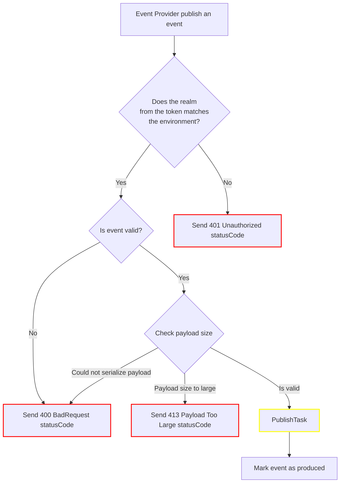
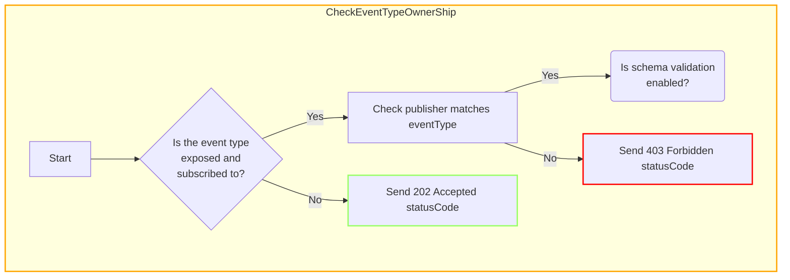
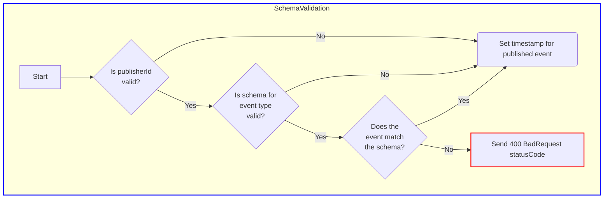

<!--
Copyright 2024 Deutsche Telekom IT GmbH

SPDX-License-Identifier: Apache-2.0
-->

# Architecture
The main function of the Starlight component is to enable the publishing of individual events.
Event publishers can interact with the component by sending a POST request to the endpoint with the value /events.
This allows event publishers to send events to Horizon, where the events are routed to the appropriate consumers of the event type.

When the endpoint is called, the Starlight component checks whether the realm from the token matches the environment to ensure authentication.
Then the corresponding event is validated and the payload is searched for the eventType.
To ensure that the given payload does not exceed the maximum payload size, this is also validated.

If all validations are successful and this does not lead to an exception and an unwanted statusCode, the publishTask starts.

The publishTask starts with the validation of the eventType if the publisherCheck is enabled.
It checks whether the eventType has been properly exposed and whether a subscriber/consumer exists for the corresponding eventType.
If this is not the case, the Starlight component returns a 202 Accepted statusCode. Otherwise, the publisher is validated with the eventType to ensure that the eventType is only used by the publisher for which it is authorized.

The next step is to trigger a schema check when the function is activated.
The schema check starts with validating the publisherId and checking the schema of the eventType.
If the schema is valid, the json event is validated with the json schema.
If this fails, a 400 BadRequest is returned.
Otherwise, the schemaValidation is canceled and the event is provided with a timestamp.

If checkEventTypeOwnerShip and schemaValidation have been successfully completed or disabled and the event has been timestamped, the publishEventMessage is created.
The status of the message is set to PROCESSED and the specified http filter is applied. After that, Starlight tries to write the event with the status PROCESSED into the kafka.
If this works, the publishTask is finished and the event is marked as produced.
If writing to the kafka failed, an exception check is performed and the exception is written before the event is also marked as produced.

Furthermore, similar to all other components in Horizon, the Starlight component incorporates logs, tracing, and metrics to document its functionalities and performance metrics.

# Flowchart

## Publish Task

```mermaid
flowchart TD
    subgraph PublishTask [Publish Task]
        style PublishTask stroke:#FFFF00,stroke-width:2px

        Start_PublishTask[Start]

        Start_PublishTask --> PublisherCheck{Verify if <br> publisherCheck is <br> enabled}
        
        PublisherCheck -->| Enabled | CheckEventTypeOwnerShip[CheckEventTypeOwnerShip]
        style CheckEventTypeOwnerShip stroke:#FFA500,stroke-width:2px
    
        CheckEventTypeOwnerShip --> | If publisher matches eventType | SchemaValidationCheck{Is schema validation enabled?}
        
        PublisherCheck -->| Disabled | SchemaValidationCheck

        SchemaValidationCheck -->| Enabled | SchemaValidation(Is schema validation <br> enabled?)
        style SchemaValidation stroke:#0000FF,stroke-width:2px

        SchemaValidation --> | Invalid publisherId/ schema <br> for eventType or event match the schema | AddTimeToEventIfAbsent(Set timestamp for published event)

        SchemaValidationCheck -->| Disabled | AddTimeToEventIfAbsent

        AddTimeToEventIfAbsent --> CreatePublishedEventMessage[Create PublishedEventMessage]

        CreatePublishedEventMessage --> FilterHttpHeader(Filter HTTP-Header of event Message)
        
        FilterHttpHeader --> SendToKafka{Send statusMessage <br> to Kafka}
        
        SendToKafka -->| Success | Success[Send PROCESSES statusMessage]
        SendToKafka -->| Payload size too large | PayloadTooLarge_2[Send 413 Payload Too Large statusCode]
        SendToKafka -->| Other exception | GatewayTimeout[Send 504 Gateway Timeout statusCode]
        style PayloadTooLarge_2 stroke:#FF0000,stroke-width:2px
        style GatewayTimeout stroke:#FF0000,stroke-width:2px

    end
```

## CheckEventTypeOwnerShip

## SchemaValidation

        