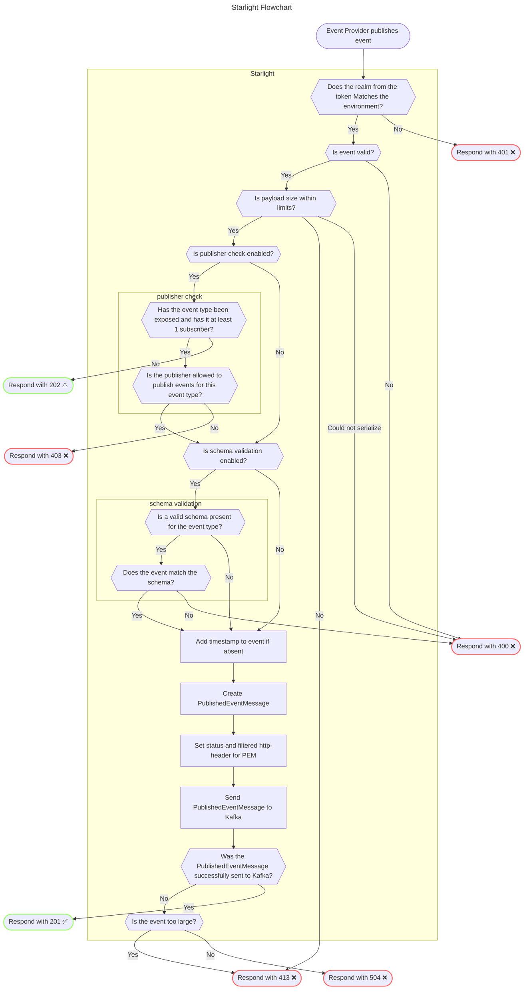

# Architecture

```mermaid
---
title: Starlight Flowchart
---

graph TD;
    A([Event Provider publishes event]) --> d0;
    subgraph Starlight 
        d0{{Does the realm from the token Matches the environment?}}
        d0 -->|Yes| d1
        
        d1{{Is event valid?}}
        d1 -->|Yes| d2
        
        d2{{Is payload size within limits?}}
        d2 -->|Yes| d3
        
        d3{{Is publisher check enabled?}}
        d3 -->|Yes| d3.1
        d3 -->|No| d4
        
        subgraph sg1[publisher check]
            d3.1{{Has the event type been exposed and has it at least 1 subscriber?}}
            d3.1 -->|Yes| d3.2

            d3.2{{Is the publisher allowed to publish events for this event type?}}
            
        end
        d3.2 -->|Yes| d4
        
        d4{{Is schema validation enabled?}}
        d4 -->|Yes| d4.1
        d4 -->|No| a1
        
        subgraph sg2[schema validation]
            d4.1{{Is a valid schema present for the event type?}}
            d4.1 -->|Yes| d4.2

            d4.2{{Does the event match the schema?}}
        end
        d4.1 -->|No| a1
        d4.2 -->|Yes| a1
        
        
        a1[Add timestamp to event if absent] --> a2
        a2[Create PublishedEventMessage] --> a3
        a3[Set status and filtered http-header for PEM] --> a4
        a4[Send PublishedEventMessage to Kafka] --> d5
        
        d5{{Was the PublishedEventMessage successfully sent to Kafka?}}
        d5 -->|No| d5.1
        
        d5.1{{Is the event too large?}}
        
    end
    
    sg1:::sg
    sg2:::sg

    d0 -->|No| 401
    d1 -->|No| 400
    d2 -->|No| 413
    d2 -->|Could not serialize| 400
    d3.1 -->|No| 202
    d3.2 -->|No| 403
    d4.2 -->|No| 400
    d5 -->|Yes| 201
    d5.1 -->|Yes| 413
    d5.1 -->|No| 504


    201([Respond with 201 ✅]):::success
    202([Respond with 202 ⚠️]):::success
    400([Respond with 400 ❌]):::error
    401([Respond with 401 ❌]):::error
    403([Respond with 403 ❌]):::error
    413([Respond with 413 ❌]):::error
    504([Respond with 504 ❌]):::error
    
    classDef success stroke:#9f6,stroke-width:2px;
    classDef error stroke:#f66,stroke-width:2px;
    classDef sg margin-right:10em;
```